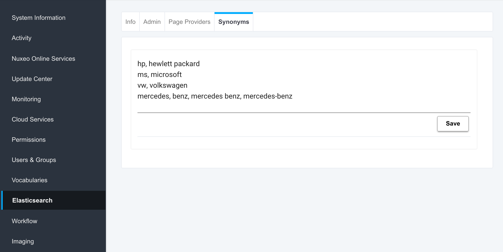

# About nuxeo-es-synonyms

  
This plug-in enables the administration of synonyms through the admin interface

Build Status: <a href='https://qa.nuxeo.org/jenkins/view/sandbox/job/Sandbox/job/sandbox_nuxeo-es-synonyms-master/'></a>


## List of Features

- Elasticsearch analyzer which use the synonyms filter
- Nuxeo operations to read and write synonyms and to run a reindexation of Elasticsearch
- A UI based on Web Components to visualize and edit synonyms through the admin interface

## Important Notes

If you're running ElasticSearch as a standalone you need to do 2 things:

1. Copy the file `nuxeo-es-synonyms/nuxeo-es-synonyms-mp/src/main/resources/install/templates/es/config/synonyms.txt` into the folder `etc/elasticsearch/`

2. Add an entry in the `nuxeo.conf` file for the property `org.nuxeo.synonyms.path=` and set it to the path to the `synonyms.txt`

If you want to ElasticSearch to automatically reindex any time the synonyms change, add an entry in the `nuxeo.conf` file for the property `org.nuxeo.synonyms.autoreindex=true`.


## Build

### Install Dependencies

#### Quickstart for Experienced Users

With Node.js installed, run the following from root of your `nuxeo-es-synonyms` clone:

```sh
npm install -g gulp bower && npm install && bower install
```

#### Prerequisites

- Node.js, used to run JavaScript tools from the command line.
- npm, the node package manager, installed with Node.js and used to install Node.js packages.
- gulp, a Node.js-based build tool.
- bower, a Node.js-based package manager used to install front-end packages (like Polymer).

**To install dependencies: (from command line)**

1.  Check your Node.js version.

```
node --version
```

The version should be at or above 4.2.3.

2.  If you don't have Node.js installed, or you have an older version, go to [nodejs.org](https://nodejs.org) to download and install it.

3.  Install `gulp` and `bower`:

```
npm install -g gulp
npm install bower
```

4.  Install the app's local `npm` and `bower` dependencies.

```
cd nuxeo-es-synonyms/nuxeo-es-synonyms-ui
npm install
bower install
```

This installs the `nuxeo-es-synonums` front-end depdendencies.

### Build

Assuming maven is correctly setup on your computer go under the `nuxeo-es-synonyms` folder and run:

```
mvn install
```

## Support

**These features are not part of the Nuxeo Production platform.**

These solutions are provided for inspiration and we encourage customers to use them as code samples and learning resources.

This is a moving project (no API maintenance, no deprecation process, etc.) If any of these solutions are found to be useful for the Nuxeo Platform in general, they will be integrated directly into platform, not maintained here.


## Licensing

[Apache License, Version 2.0](http://www.apache.org/licenses/LICENSE-2.0)


## About Nuxeo

Nuxeo dramatically improves how content-based applications are built, managed and deployed, making customers more agile, innovative and successful. Nuxeo provides a next generation, enterprise ready platform for building traditional and cutting-edge content oriented applications. Combining a powerful application development environment with SaaS-based tools and a modular architecture, the Nuxeo Platform and Products provide clear business value to some of the most recognizable brands including Verizon, Electronic Arts, Netflix, Sharp, FICO, the U.S. Navy, and Boeing. Nuxeo is headquartered in New York and Paris.

More information is available at [www.nuxeo.com](http://www.nuxeo.com).
